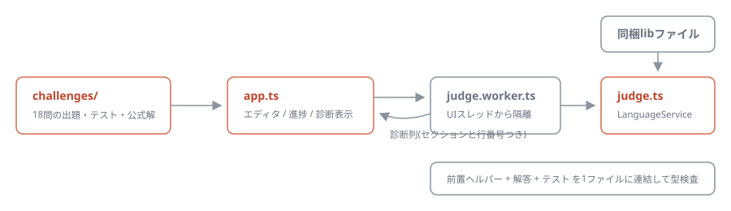

# type-dojo

[](https://github.com/miruky/type-dojo/actions/workflows/ci.yml)
[](https://www.typescriptlang.org/)
[](https://vitest.dev/)
[](https://opensource.org/licenses/MIT)

**ブラウザ内で動くTypeScriptコンパイラが解答を判定する、型レベルプログラミングの演習場です。**

## 概要

MyPickやDeepReadonlyのような型エイリアスを実装する18問を、初級・中級・上級に分けて出題します。エディタに型を書いて判定ボタンを押すと、Web Workerの中で本物のTypeScriptコンパイラ(LanguageService)が「前置ヘルパー + 解答 + テスト」を型検査し、エラーがなければ合格です。選択肢クイズではなく、`Equal<X, Y>` による真の型一致でテストされるため、anyでごまかした解答やreadonly修飾の漏れも不合格になります。クリア状況と書きかけの解答はlocalStorageに保存されます。

試す: https://miruky.github.io/type-dojo/

### なぜ作ったのか

型レベルプログラミングの練習問題は、エディタとtscを往復しながら解くとフィードバックの間隔が長く、つまずいた瞬間の型エラーも流れてしまいます。書いてすぐ判定され、どの行がどう間違っているかがその場に残る環境が欲しくて作りました。判定器を自前のパターンマッチではなく本物のコンパイラにしたのは、出題側の手抜きで「正しいのに不合格」が起きるのを避けるためです。

## 使い方

- 左の一覧から問題を選び、雛形の `any` を自分の実装に置き換えて「判定」を押します(Ctrl+Enterでも可)
- 不合格のときは、解答とテストのどちらの何行目で型エラーが出たかが一覧されます
- 「ヒント」は考え方を、「解答を見る」は解答例を表示します
- 前置ヘルパー `Expect` / `Equal` / `NotEqual` は解答の実装からも使えます(上級のIncludesで必要になります)

## アーキテクチャ



出題データ(問題文・雛形・テスト・公式解)は `src/lib/challenges/` に集約され、判定器 `judge.ts` はTypeScriptのLanguageServiceを仮想ファイルの上で動かします。型検査に必要なlibファイル(ES系)はビルド時にバンドルへ同梱するため、実行時のネットワーク取得はありません。コンパイラは重いのでWeb Workerに隔離し、UIスレッドは診断の結果だけを受け取ります。CIでは全18問について「公式解が合格し、雛形のままでは不合格になる」ことを機械検証しており、出題自体の壊れを防いでいます。

## 技術スタック

| カテゴリ | 技術                          |
| :------- | :---------------------------- |
| 言語     | TypeScript 5(strict)          |
| 判定     | TypeScript Compiler API(同梱) |
| ビルド   | Vite                          |
| テスト   | Vitest(59テスト)              |
| リンタ   | ESLint + Prettier             |
| CI / CD  | GitHub Actions                |
| 配信     | GitHub Pages                  |

## プロジェクト構成

- `src/lib/judge.ts` — 判定器。LanguageServiceと同梱libによる型検査、診断の行番号マッピング
- `src/lib/prelude.ts` — 判定対象の先頭に連結されるヘルパー型(Expect / Equal / NotEqual)
- `src/lib/challenges/` — 出題データ。難易度別の3ファイル+型定義
- `src/lib/storage.ts` — localStorageが使えない環境向けのフォールバックつき保存層
- `src/judge.worker.ts` — 判定をUIスレッドから隔離するWorker
- `src/app.ts` — 一覧・エディタ・判定結果・進捗のUI
- `docs/architecture.svg` — アーキテクチャ図

## はじめ方

### 前提条件

- Node.js 20 以上

### セットアップ

```bash
npm ci
npm run dev
```

### テストとlint

```bash
npm test
npm run lint
```

### ビルド

```bash
npm run build
```

GitHub Pagesへは `main` へのpushで自動デプロイされます。サブパス配信のため、ワークフローでは環境変数 `TYPEDOJO_BASE=/type-dojo/` を渡してViteの `base` を切り替えています。

## 設計方針

- **判定は本物のコンパイラで**: 解答の正誤は文字列比較や簡易パーサではなく、tscと同じ型検査で決まります。`@ts-expect-error` の未使用検出も効くため、「制約を付けず何でも受け取る」緩い解答は負例テストで弾かれます。
- **出題も機械検証する**: 各問題の公式解と雛形をCIで判定器に通し、出題・テスト・判定器のどれが壊れても気づけるようにしています。
- **重さは隔離し、軽さは保つ**: コンパイラ(約1MB gzip)はWorker側のチャンクに分離し、初期表示のJSは数十KBに収めています。それでも初回の判定はコンパイラの読み込みぶん待ちが発生します。診断メッセージはTypeScriptが出す英語のままです。

## ライセンス

[MIT](LICENSE)
